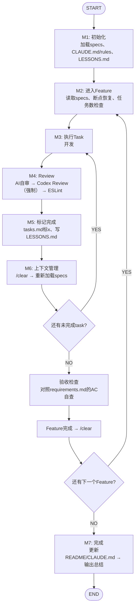

# /dean:ai — 自动开发

`$ARGUMENTS` — specs 文件夹路径 + 代码项目路径（单项目场景下一般是同一个目录）。

```bash
/dean:ai specs在./specs，代码在./
/dean:ai ./
```

## 流程图



## 节点说明

### M1: 初始化

1. 从 `$ARGUMENTS` 提取 specs 文件夹路径和代码项目路径
2. 扫描 specs/ 下所有编号目录（`1.xxx/`、`2.xxx/`），按编号排列
3. 每个 feature 目录须含 requirements.md、design.md、tasks.md
4. 加载代码项目的 `.claude/CLAUDE.md` + `.claude/rules/`
5. 加载 `{SPECS_DIR}/LESSONS.md`（如果存在，里面是架构决策和踩坑记录，开发时必须参考）
6. 验证代码项目路径存在

**状态写入（进入 M1 时）：** 用 Write 工具写入 `{SPECS_DIR}/workflow-status.json`（占位符须替换为实际值）：
```jsonc
{"node":"M1","nodeLabel":"初始化","featureId":0,"featureName":"","featureProgress":"","taskId":"","taskTitle":"","taskProgress":"","status":"in_progress","updatedAt":"2026-06-20T00:00:00.000Z"}
```
**状态写入（M1 完成时）：** 将 `"status"` 改为 `"completed"` 再写一次。

### M2: 进入 Feature

1. 读取该 feature 的 requirements.md、design.md、tasks.md
2. 断点恢复：`[x]` 已完成 → 跳过，`[DROPPED]` → 跳过，`[CHANGED]` → 按更新后描述执行
3. 如该 feature 所有任务已完成 → 跳过，进入下一个 feature

**状态写入（进入 M2 时）：** 用 Write 工具写入 `{SPECS_DIR}/workflow-status.json`（占位符须替换为实际值）：
```jsonc
{"node":"M2","nodeLabel":"进入 Feature","featureId":2,"featureName":"user-auth","featureProgress":"1/6","taskId":"","taskTitle":"","taskProgress":"","status":"in_progress","updatedAt":"2026-06-20T00:00:00.000Z"}
```
`featureProgress` = 已完成 feature 数 / 总 feature 数。**状态写入（M2 完成时）：** 将 `"status"` 改为 `"completed"` 再写一次。

**任务数检查（强制）：** 统计未完成任务数（`[ ]` 的行）

- **≤8 个** → 正常执行
- **>8 个** → 自动拆分：保留前 8 个任务在当前 tasks.md，剩余写入新 feature 目录 `{N+0.5}.{feature-name}-part2/`（编号取当前最大编号+1），新目录复制当前 requirements.md 和 design.md，tasks.md 只含剩余任务，输出提示 `⚠️ 任务数超出上限，已自动拆分为 {新feature目录名}` 后继续执行当前 feature

**执行方式：** 单人开发，全部按 tasks.md 顺序串行执行，不做多 agent 并行派发。

输出：

```text
📂 Feature {N}/{总数} — {feature名}
📋 待执行任务：T-001 → T-002 → T-003 → ...
```

### M3: 执行 Task

开始标记：

```text
🔨 Task {T-编号}: {任务描述} ~{预估时间}
   Feature {F}/{总F} | 任务 {N}/{总数}
```

- 参考 design.md 技术设计和 `.claude/rules/` 规范开发
- 技术选型自行选最优解，不暂停
- 业务逻辑/产品方向问题不确定 → 暂停与用户沟通

**状态写入（进入 M3 时，每个 task 开始前）：** 用 Write 工具写入 `{SPECS_DIR}/workflow-status.json`（占位符须替换为实际值）：
```jsonc
{"node":"M3","nodeLabel":"执行 Task","featureId":2,"featureName":"user-auth","featureProgress":"1/6","taskId":"T-003","taskTitle":"登录接口","taskProgress":"2/8","status":"in_progress","updatedAt":"2026-06-20T00:00:00.000Z"}
```
`featureProgress` = 已完成 feature 数 / 总 feature 数；`taskProgress` = 当前 feature 已完成 task 数 / 当前 feature 总 task 数。**状态写入（M3 完成时，即 task 开发完毕进入 Review 前）：** 将 `"status"` 改为 `"completed"` 再写一次。

### M4: Review（AI 自审 + Codex Review，强制）

**状态写入（进入 M4 时）：** 用 Write 工具写入 `{SPECS_DIR}/workflow-status.json`（占位符须替换为实际值）：
```jsonc
{"node":"M4","nodeLabel":"Review","featureId":2,"featureName":"user-auth","featureProgress":"1/6","taskId":"T-003","taskTitle":"登录接口","taskProgress":"2/8","status":"in_progress","updatedAt":"2026-06-20T00:00:00.000Z"}
```
**状态写入（M4 完成时）：** 将 `"status"` 改为 `"completed"` 再写一次。

每个 task 完成后必须执行，按**单个 task 粒度**审查。

**1. AI 自审**

检查本 task 变更的：

- 代码质量：命名、结构、可读性、是否符合 `.claude/rules/`
- 逻辑正确性：边界条件、错误处理、并发安全
- 安全性：硬编码密钥、`.env` 误入 git、注入漏洞
- 性能：N+1 查询、不必要的重复计算、内存泄漏风险

发现问题立即修复，不确定则暂停。

**2. Codex Review（强制）**

AI 自审通过后，调用 `/codex:review <本task涉及的文件路径>`（这是一个独立命令，封装了实际调用 Codex CLI 的逻辑，定义在 `~/.claude/commands/codex/review.md`）：

- 只传入**本 task 涉及的变更文件路径**（不要传整个 working tree）
- `/codex:review` 内部会用 Bash 工具真正执行 `codex exec` 命令，并把 Codex 返回的原始结果展示出来
- 合理建议 → 修复后重新调用 `/codex:review` 复审
- 误报 → 记录理由后忽略
- **如果 `/codex:review` 报告 Codex CLI 不可用 → 暂停并明确告知用户，禁止静默改用纯 AI 自审代替而不告知**
- **审查通过后方可进入 M5**

**3. ESLint**

执行整体代码的 ESLint，遇到错误让 ESLint 自动修复。

### M5: 标记完成（强制，不可跳过）

**状态写入（进入 M5 时）：** 用 Write 工具写入 `{SPECS_DIR}/workflow-status.json`（占位符须替换为实际值）：
```jsonc
{"node":"M5","nodeLabel":"标记完成","featureId":2,"featureName":"user-auth","featureProgress":"1/6","taskId":"T-003","taskTitle":"登录接口","taskProgress":"2/8","status":"in_progress","updatedAt":"2026-06-20T00:00:00.000Z"}
```
**状态写入（M5 完成时）：** 将 `"status"` 改为 `"completed"`，同时将 `taskProgress` 的已完成数加一（此时 task 已标记 `[x]`）再写一次。

遗漏会导致断点恢复时重复执行任务。

1. 用 Edit 工具打开 tasks.md，找到当前任务对应的行
2. 将 `- [ ]` 改为 `- [x]`，**仅改 checkbox，不改其他内容**
3. **立即验证**：改完后重新读取 tasks.md，确认该任务确实已标记为 `[x]`

**LESSONS.md：** 如有值得记录的内容（架构决策及理由、踩坑记录、跨 feature 影响、环境/依赖特殊处理）追加到 `{SPECS_DIR}/LESSONS.md`，格式：`## {日期} — {Feature名} / {Task标题}`。不记录常规开发、显而易见的事情。

输出进度：

```text
✅ Feature {F}/{总F} | 任务 {N}/{总数} — {标题}
🔍 AI review: {结果} | 🤖 Codex review: {结果}
📊 Feature {done}/{total} | 总体 {done_f}/{total_f}
```

### M6: 上下文管理

**状态写入（进入 M6 时）：** 用 Write 工具写入 `{SPECS_DIR}/workflow-status.json`（占位符须替换为实际值）：
```jsonc
{"node":"M6","nodeLabel":"上下文管理","featureId":2,"featureName":"user-auth","featureProgress":"1/6","taskId":"T-003","taskTitle":"登录接口","taskProgress":"3/8","status":"in_progress","updatedAt":"2026-06-20T00:00:00.000Z"}
```
**状态写入（M6 完成时）：先写 `"status": "completed"` 再执行 `/clear`**，避免 /clear 后丢失上下文导致状态遗留 `in_progress`。

**task 完成后：** 执行 `/clear`，重新读取当前 feature 的 specs（requirements.md、design.md、tasks.md）+ LESSONS.md + `.claude/CLAUDE.md`/`rules/`，继续下一个 task。

**task 执行中：** 上下文达 80% → 执行 `/compact` 后继续当前 task。

全程自动继续，无需等待用户指令。

**Feature 完成时的验收检查：** 该 feature 所有 task 标记完成后，对照 requirements.md 里的验收标准（AC-001 等）逐条自查一遍，确认全部满足才算真正完成；如果发现某条没满足，回到对应 task 补做，不要直接放过。完成后执行 `/clear`，进入下一个 feature。

### M7: 完成

**状态写入（进入 M7 时）：** 用 Write 工具写入 `{SPECS_DIR}/workflow-status.json`：
```jsonc
{"node":"M7","nodeLabel":"完成","featureId":0,"featureName":"","featureProgress":"","taskId":"","taskTitle":"","taskProgress":"","status":"in_progress","updatedAt":"2026-06-20T00:00:00.000Z"}
```
**状态写入（M7 完成后，全部结束时）：** 重置为 IDLE_STATUS：
```jsonc
{"node":"idle","nodeLabel":"","featureId":0,"featureName":"","featureProgress":"","taskId":"","taskTitle":"","taskProgress":"","status":"idle","updatedAt":"2026-06-20T00:00:00.000Z"}
```

所有 feature 的所有任务完成后：

1. 自己动手更新 README（架构 + 业务 + 快速开始）和 `.claude/CLAUDE.md`/`rules/`（如果开发过程中有偏离原计划的地方）
2. 输出总结：

```text
🎉 全部完成

📂 Features: {完成数}/{总数}
📋 总任务: {完成数}/{总数}
📝 文档同步: 已完成

各 Feature 摘要:
- 1.{name}: {N} 个任务 ✅
- 2.{name}: {N} 个任务 ✅
```

## 全局规则

- 每个节点必须按顺序执行，**严禁跳过任何节点**
- 每个节点执行完毕后，必须输出确认行，格式：`✓ [节点名] 完成，进入 [下一节点名]`
- 未完成当前节点前，不得进入下一节点
- **暂停：** 业务逻辑歧义、不确定的安全问题、破坏性变更、环境阻塞
- **不暂停：** 纯技术选型 — 选最优解直接执行
- **每个节点开始执行和完成时**，除了输出确认行，还要按各节点说明中的「状态写入」指令用 Write 工具更新 `specs/workflow-status.json`，供 `/workflow` 页面实时监控读取